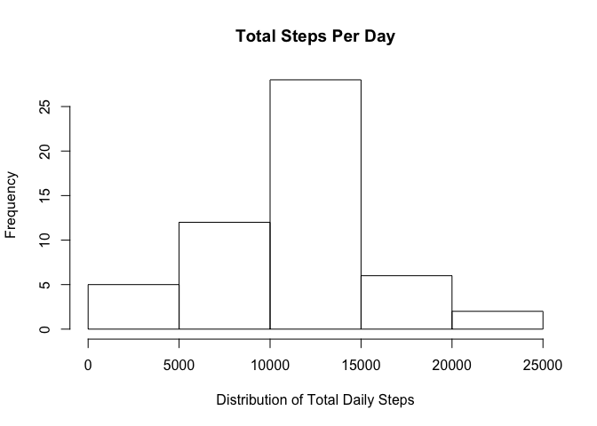
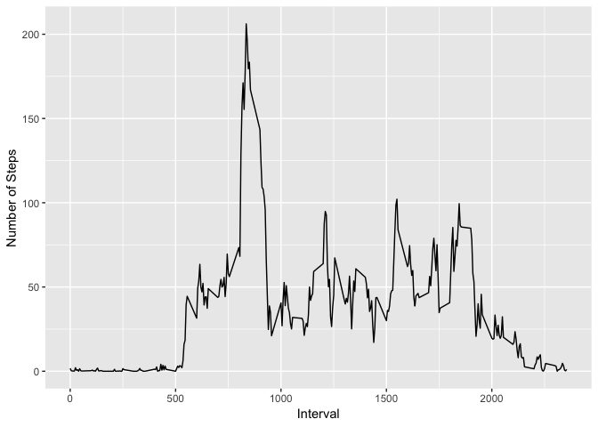
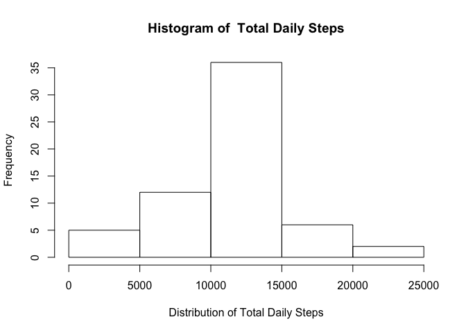
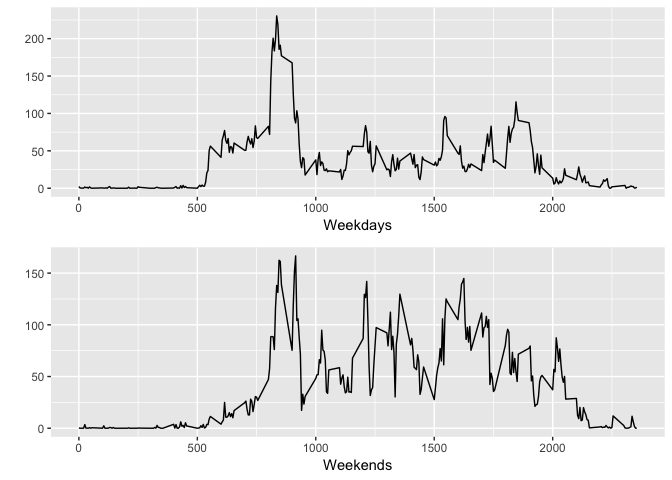

---
title: "RepResearch_peerAssignment"
output: 
  html_document:
    keep_md: yes
---
Week two Course Project in Reproducible Research
==================================================


```r
knitr::opts_chunk$set(echo = TRUE)
```

In this report, we use two months data about movement from an annoymous individual collected during the months of october and November 2012 and include  the number of the steps taken every 5 mins.

I proceed by importing the data from a gitbub repository as shown below

```r
finame <- unzip("activity.zip", list=TRUE)$Name[1]
data <- read.csv(unzip("activity.zip", finame))
data$date<-as.Date(data$date)
```

Having downloaded the data, we perform the following descriptives.
First, we compute the total number of steps taken per day and plot its histogram as shown below:

```r
totalsteps=tapply(data$steps, data$date, sum)
hist(totalsteps, xlab="Distribution of Total Daily Steps", main="Total Steps Per Day")
```

<!-- -->


The mean of the total number of steps is given by:


```r
mean_steps=mean(na.omit(as.vector(tapply(data$steps, data$date, sum))))
mean_steps
```

```
## [1] 10766.19
```

and median of the total number of steps is given by:


```r
median_steps=median(na.omit(as.vector(tapply(data$steps, data$date, sum))))
median_steps
```

```
## [1] 10765
```

We not make a time series plot of the average number of steps taken in each five minutes interval average across all days.


```r
data1=ddply(data, .(interval), summarize, 
            daily_mean_steps= mean(na.omit(steps)))
ggplot(data1, aes(interval, daily_mean_steps)) + geom_line() +
       ylab("Number of Steps") + xlab("Interval")
```

<!-- -->

We also show the 5-minute interval, on average across all the days in the dataset which contains the maximum number of steps below.


```r
data1[which.max(data1$daily_mean_steps),]
```

```
##     interval daily_mean_steps
## 104      835         206.1698
```

```r
data1=NULL
```

The next part deals with imputing missing values. <br />
We proceed by reporting the total number of missing values below


```r
length(which((is.na(data$steps))))
```

```
## [1] 2304
```

We now fill in all the missing values. Our strategy is to replace a missing value in an interval with the average of that interval averaged across all the days where such value is non-missing. For example if in a given day (say 1st Oct.), interval 10 is "NA", I will compute the average of interval 10 across all days where interval 10 is available and use that value as interval 10 for that given day (say 1st Oct.) <br />
I will now create a new dataset with this filling strategy and construct an histogram of the total number of steps taken each day (just as before), and I will report  the new mean and median.

```r
data2=data
data2$steps <- ifelse(is.na(data$steps), ave(na.omit(data$steps), data$interval, FUN=mean), data$steps)
```

```
## Warning in split.default(x, g): data length is not a multiple of split
## variable
```

```
## Warning in split.default(seq_along(x), f, drop = drop, ...): data length is
## not a multiple of split variable
```

```r
hist(tapply(data2$steps, data2$date, sum), xlab="Distribution of Total Daily Steps", main="Histogram of  Total Daily Steps")
```

<!-- -->

```r
mean_steps2=mean(na.omit((tapply(data2$steps, data2$date, sum))))
mean_steps2
```

```
## [1] 10766.19
```

```r
median_steps2=median(na.omit(as.vector(tapply(data2$steps, data2$date, sum))))
median_steps2
```

```
## [1] 10766.19
```

By construction, the mean did not change because we were simply adding the mean of all days to an already existing mean and averaging. However, we see that after imputing with out strategy, the median is equal to our mean. This hows that the number of steps taken follows a normal distribution. That is, fewer steps in the early hours of a days, few steps in the late hours of the day and bulk of the steps during mid periods of the day. This pattern is not surprising. <br />
<br />
We now proceed to the final part of our analysis where we check if there are differences in activity patterns between weekdays and weekends.<br />
<br />
We proceed by creating a new factor variable in the dataset with two levels - weekend and weekdays indicating whether a given date is a weekday or weekend day. We then, make a panel timeseries plotof the 5 minutes interval averaged across all weekday days or weekend days (y-axis). See below


```r
data2$date=as.Date(data2$date)
weekdays1 <- c('Monday', 'Tuesday', 'Wednesday', 'Thursday', 'Friday')
data2$wkday <- factor((weekdays(data2$date) %in% weekdays1), levels = c(FALSE, TRUE), labels =c('Weekend', 'Weekday') )

data3=ddply(data2[data2$wkday == "Weekday",], .(interval), summarize, daily_mean_steps= mean(steps))
data4=ddply(data2[data2$wkday == "Weekend",], .(interval), summarize, daily_mean_steps= mean(steps))
p1=qplot(data3$interval, data3$daily_mean_steps, geom="line", ylab="", xlab="Weekdays" )
p2=qplot(data4$interval, data4$daily_mean_steps, geom="line", ylab="", xlab="Weekends")
grid.arrange(p1, p2, nrow = 2)
```

<!-- -->

```r
data3=NULL
data4=NULL
```
